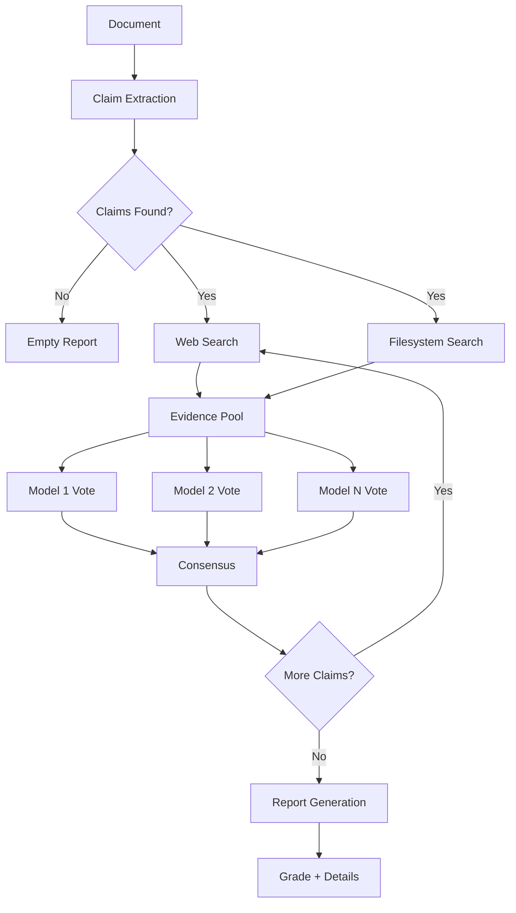

# Truthfulness Evaluator

Multi-model truthfulness evaluation with filesystem-aware evidence gathering.

---

[](https://github.com/Sosoka-Labs/truthfulness-evaluator/actions/workflows/ci.yml)
[](https://www.python.org/downloads/)
[](https://www.gnu.org/licenses/gpl-3.0)

---

## Overview

Truthfulness Evaluator automates fact-checking for technical documentation. It extracts verifiable claims from your Markdown files, gathers evidence from web searches and your actual codebase, then uses multiple AI models to verify each claim through weighted consensus.

Stop shipping documentation that drifts from reality. Run this tool in CI to catch outdated READMEs, verify API references match actual code, and ensure your technical claims are backed by evidence.

## Key Features

- **Multi-Model Consensus** - GPT-4o, Claude, and other models vote independently on verdicts, reducing hallucination risk through ensemble verification
- **Filesystem Evidence** - React agent browses your codebase, reads source files, and follows imports to verify code-specific claims
- **Web Search Integration** - DuckDuckGo search for external fact verification with URL fetching and content analysis
- **Pluggable Workflows** - Composable extractors, gatherers, verifiers, and formatters with built-in presets (external, full, quick, internal)
- **Structured Outputs** - Pydantic models throughout, no brittle JSON parsing, full type safety
- **Rich Reports** - JSON, Markdown, and HTML output formats with evidence citations and confidence scores
- **LangGraph 1.0+** - Durable execution with checkpointing, streaming, and human-in-the-loop support

## Quick Start

### Installation

```bash
pip install truthfulness-evaluator
```

Set your OpenAI API key:

```bash
export OPENAI_API_KEY="sk-..."
```

Optional (for multi-model consensus):

```bash
export ANTHROPIC_API_KEY="sk-ant-..."
```

### Basic Usage

Verify a document:

```bash
truth-eval README.md
```

Generate a Markdown report:

```bash
truth-eval README.md -o report.md
```

Check documentation against your actual codebase:

```bash
truth-eval README.md --root-path . --mode both
```

Full options:

```bash
truth-eval --help
```

### Example Output

```
📊 Truthfulness Evaluation Report
━━━━━━━━━━━━━━━━━━━━━━━━━━━━━━━━━━━━━━━━━━━━━━━━━━━━━━━━━━━━━
Grade: A | Overall Confidence: 87.3%
━━━━━━━━━━━━━━━━━━━━━━━━━━━━━━━━━━━━━━━━━━━━━━━━━━━━━━━━━━━━━

📋 Extracted 5 claims from README.md

✅ SUPPORTED (95% confidence)
   Claim: "Requires Python 3.11 or higher"
   🗳️  Votes: gpt-4o: SUPPORTS, gpt-4o-mini: SUPPORTS
   📁 Evidence: pyproject.toml (requires-python = ">=3.11")

✅ SUPPORTED (92% confidence)
   Claim: "Built on LangGraph 1.0+ and LangChain 1.0+"
   🗳️  Votes: gpt-4o: SUPPORTS, gpt-4o-mini: SUPPORTS
   📁 Evidence: pyproject.toml (langgraph = "^1.0.0")

❌ REFUTED (90% confidence)
   Claim: "Supports JavaScript and TypeScript codebases"
   🗳️  Votes: gpt-4o: REFUTES, gpt-4o-mini: REFUTES
   📁 Evidence: Only Python file parsing found

━━━━━━━━━━━━━━━━━━━━━━━━━━━━━━━━━━━━━━━━━━━━━━━━━━━━━━━━━━━━━
Summary: 3 supported, 1 refuted, 1 needs review
```

## How It Works



1. **Claim Extraction** - LLM parses the document and extracts verifiable factual statements as structured Pydantic models, skipping opinions and predictions.

2. **Evidence Gathering** - For each claim, the system searches multiple sources in parallel: web search via DuckDuckGo for external facts, and a filesystem React agent for code-specific claims (reads files, parses AST, follows imports).

3. **Multi-Model Verification** - Each claim is sent to multiple AI models independently. Models analyze evidence and return structured verdicts (SUPPORTS, REFUTES, or NOT_ENOUGH_INFO) with confidence scores.

4. **Consensus and Grading** - Model votes are aggregated through weighted consensus. Final report includes letter grade (A+ to F), evidence citations, and detailed explanations.

## Use Cases

- **Documentation Review** - Catch outdated claims in READMEs before release
- **Technical Writing** - Verify API claims against actual code signatures
- **Content Validation** - Fact-check blog posts and tutorials before publishing
- **CI/CD Integration** - Fail builds when documentation drifts from code
- **Code Review** - Validate docstrings and comments match implementation

## Documentation

Full documentation: [https://sosoka-labs.github.io/truthfulness-evaluator/](https://sosoka-labs.github.io/truthfulness-evaluator/)

- [Installation Guide](./docs/getting-started/installation.md)
- [Quick Start Tutorial](./docs/getting-started/quickstart.md)
- [CLI Reference](./docs/usage/cli.md)
- [Python API](./docs/usage/python-api.md)
- [Workflows Guide](./docs/usage/workflows.md)
- [API Reference](./docs/api/graph.md)

## Development

### Setup

```bash
git clone https://github.com/Sosoka-Labs/truthfulness-evaluator.git
cd truthfulness-evaluator
poetry install
```

### Testing

```bash
poetry run pytest
poetry run pytest --cov=src/truthfulness_evaluator
```

### Code Quality

```bash
poetry run black src/ tests/
poetry run ruff check src/ tests/
poetry run mypy src/
```

### Documentation

```bash
mkdocs serve    # Dev server at http://localhost:8000
mkdocs build    # Build static site
```

## License

GPL-3.0 License. See [LICENSE](./LICENSE) for details.

## Contributing

Contributions welcome! See [CONTRIBUTING.md](./CONTRIBUTING.md) for development setup and guidelines.

## Author

**John Sosoka**

- GitHub: [@johnsosoka](https://github.com/johnsosoka)
- Website: [johnsosoka.com](https://johnsosoka.com)
- Organization: [Sosoka-Labs](https://github.com/Sosoka-Labs)
