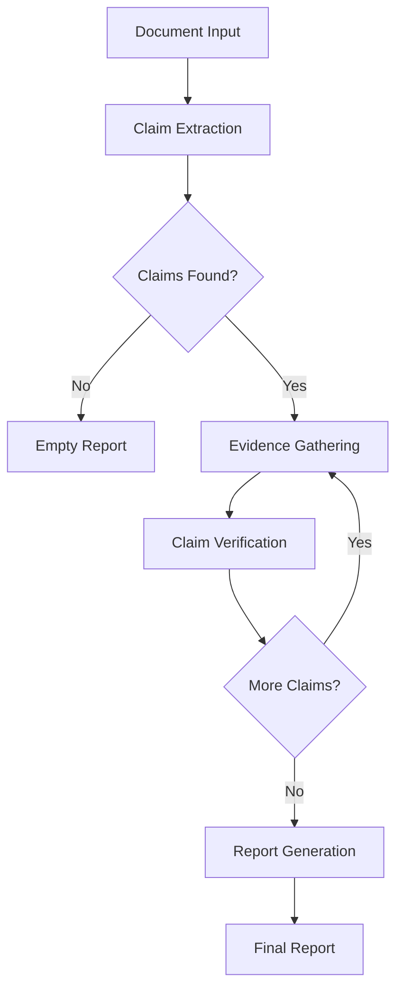
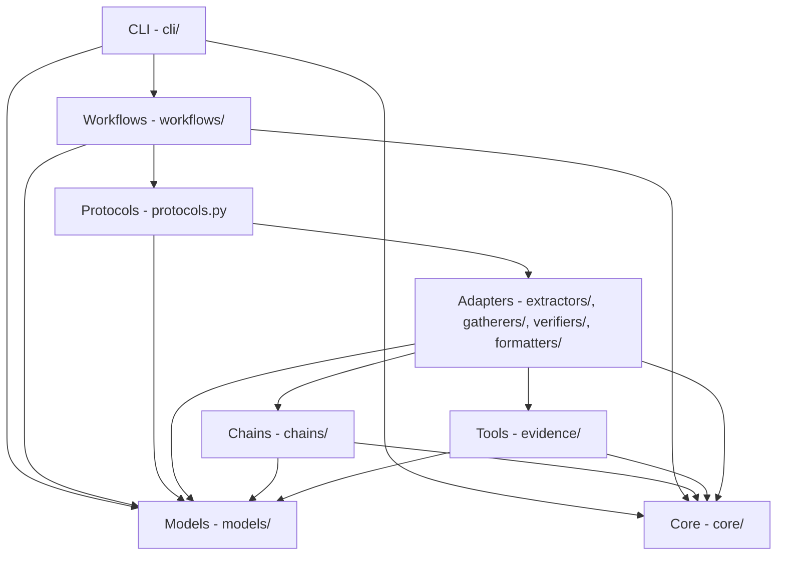

# Architecture Overview

The Truthfulness Evaluator is built on a pluggable, protocol-driven architecture that separates workflow orchestration from verification logic. This design enables custom extractors, evidence gatherers, verifiers, and formatters to be composed into specialized evaluation pipelines.

## High-Level Pipeline

The system follows a standard verification pipeline:



Each claim is extracted, evidence is gathered from multiple sources, the claim is verified against that evidence, and results are aggregated into a final graded report.

## Package Layer Architecture

The codebase is organized into clear dependency layers:



### Dependency Flow

- **CLI** invokes workflows and formats output
- **Workflows** orchestrate the pipeline using protocol-defined interfaces
- **Protocols** define contracts for pluggable strategies
- **Adapters** implement protocol interfaces by wrapping chains and tools
- **Chains** contain LLM-based logic (extraction, verification, consensus)
- **Tools** provide evidence gathering capabilities (web search, filesystem)
- **Models** define shared data structures (Pydantic models)
- **Core** provides shared utilities (config, logging, LLM factory)

## Package Descriptions

### cli/

Command-line interface built with Typer. Handles argument parsing, user interaction, and output formatting. The main entry point is `truth-eval`.

### workflows/

LangGraph state machine definitions and workflow configuration. Contains the graph nodes, edges, and state transitions for the verification pipeline. Includes the pluggable workflow system with registry and presets.

### protocols.py

Protocol definitions (structural typing) for the four core strategy interfaces: `ClaimExtractor`, `EvidenceGatherer`, `ClaimVerifier`, and `ReportFormatter`. These protocols define the contracts that adapters must satisfy.

### extractors/, gatherers/, verifiers/, formatters/

Adapter packages implementing protocol interfaces. Each adapter wraps legacy chain/tool implementations to satisfy the protocol contract. These packages enable pluggable strategies that can be mixed and matched in workflow configurations.

### chains/

Legacy LLM-based processing chains. Contains claim extraction logic, single-model verification, multi-model consensus, evidence analysis, and internal verification. These are wrapped by adapters and will eventually be refactored into strategy implementations.

### evidence/

Evidence gathering tools and agents. Includes filesystem React agent with file exploration tools, web search integration via DuckDuckGo, and enhanced filesystem tools with AST parsing.

### reporting/

Report generation and formatting. Produces JSON, Markdown, and HTML reports from verification results. Uses Jinja2 templates for structured output.

### prompts/

LLM prompt templates for extraction, verification, and consensus. Organized by domain (general, scientific, technical, historical) and task (extraction, evidence analysis, refutation).

### models/

Pydantic v2 domain models defining core data structures: `Claim`, `Evidence`, `VerificationResult`, `TruthfulnessReport`, and `TruthfulnessStatistics`. All structured outputs use these models.

### core/

Shared utilities and configuration. Includes `EvaluatorConfig` (Pydantic settings with `TRUTH_` env prefix), centralized LLM factory (`create_chat_model`), and logging configuration.

## Design Principles

### Protocol-Driven Architecture

The system uses Python's structural typing (`Protocol`) to define interfaces without requiring inheritance. Adapters satisfy protocols by implementing the required methods, enabling duck-typed composition and testing.

```python
from truthfulness_evaluator.core.protocols import ClaimExtractor

class CustomExtractor:
    async def extract(self, document: str, source_path: str, **kwargs) -> list[Claim]:
        # Implementation satisfies ClaimExtractor protocol
        ...
```

### Strategy Pattern for Pluggability

Verification workflows are composed from interchangeable strategy instances. Different extractors, gatherers, verifiers, and formatters can be mixed and matched via `WorkflowConfig`:

```python
config = WorkflowConfig(
    name="custom",
    extractor=TripletExtractor(),
    gatherers=[WebSearchGatherer(), FilesystemGatherer()],
    verifier=ConsensusVerifier(models=["gpt-4o", "claude-sonnet-4-5"]),
    formatters=[JsonFormatter(), MarkdownFormatter()],
)
```

### Separation of Orchestration and Logic

Workflows (LangGraph state machines) orchestrate the pipeline flow: claim extraction, evidence gathering loops, verification, and report generation. Business logic (how to extract, what evidence to gather, how to verify) lives in adapters and chains. This separation allows workflows to remain stable while strategies evolve.

!!! note "Migration in Progress"
    The pluggable architecture is partially implemented. Phase 1 (protocols and adapters) and Phase 2 (presets and registry) are complete. Phase 3 (workflow builder) is planned. The legacy monolithic graph API (`create_truthfulness_graph`) still works but the pluggable system is the recommended approach going forward.

## Key Architectural Patterns

### Lazy LLM Initialization

LLM instances are created lazily via `@property` decorators to avoid initialization overhead when models aren't used:

```python
@property
def llm(self):
    if self._llm is None:
        self._llm = create_chat_model(self.model_name)
    return self._llm
```

### Structured Outputs

All LLM chains use `.with_structured_output()` to return Pydantic models directly, eliminating brittle JSON parsing:

```python
chain = prompt | llm.with_structured_output(ClaimExtractionOutput)
```

### Centralized LLM Factory

The `core.llm.create_chat_model()` factory abstracts provider differences (OpenAI, Anthropic) and handles model routing, API key management, and configuration:

```python
from truthfulness_evaluator.llm.factory import create_chat_model

llm = create_chat_model("gpt-4o")  # Returns ChatOpenAI instance
llm = create_chat_model("claude-sonnet-4-5")  # Returns ChatAnthropic instance
```

### Checkpointing and Resumption

LangGraph workflows use `MemorySaver` for state persistence, enabling interruption and resumption:

```python
from langgraph.checkpoint.memory import MemorySaver

checkpointer = MemorySaver()
graph = create_truthfulness_graph(config, checkpointer=checkpointer)

# Resume from checkpoint
state = graph.get_state(config)
graph.invoke(None, config)
```

## Testing Strategy

- **Unit tests** for models, adapters, chains, and tools
- **Protocol compliance tests** verify adapters satisfy protocol interfaces
- **Integration tests** (planned) for end-to-end workflows with real LLM API calls
- **Pytest fixtures** for reusable test data and mock objects
- **Asyncio mode** auto-enabled via pytest-asyncio

## Future Directions

- **WorkflowBuilder** implementation for programmatic workflow construction
- **Additional presets** for scientific verification, API validation, and git history analysis
- **Legacy code removal** once pluggable workflows are fully adopted
- **Plugin system** via entry points for third-party workflow contributions
- **Performance optimizations** including evidence caching and early termination

!!! tip "Contributing Custom Workflows"
    To create custom workflows, implement the four protocol interfaces (`ClaimExtractor`, `EvidenceGatherer`, `ClaimVerifier`, `ReportFormatter`), bundle them in a `WorkflowConfig`, and register via `WorkflowRegistry.register()`. See [Workflows](workflows.md) for details.
