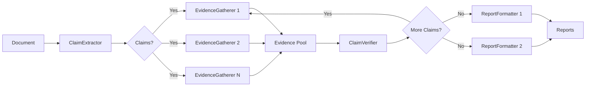

# Pluggable Workflow System

The pluggable workflow architecture enables custom verification pipelines by composing interchangeable strategies for claim extraction, evidence gathering, verification, and report formatting.

## Protocol Interfaces

The system defines four core protocols that adapters must implement:

### ClaimExtractor

Extracts factual claims from document text.

```python
from typing import Protocol
from truthfulness_evaluator.models import Claim

class ClaimExtractor(Protocol):
    async def extract(
        self,
        document: str,
        source_path: str,
        *,
        max_claims: int | None = None,
    ) -> list[Claim]:
        """Extract claims from document text.

        Args:
            document: The document text to analyze.
            source_path: Path or URL of the source document.
            max_claims: Optional limit on number of claims to extract.

        Returns:
            List of extracted Claim objects.
        """
        ...
```

Different implementations handle different document types (technical docs, scientific papers, blog posts) and extraction strategies (simple LLM extraction, triplet-based, rule-based).

### EvidenceGatherer

Searches for evidence that supports or refutes claims.

```python
from typing import Any, Protocol
from truthfulness_evaluator.models import Claim, Evidence

class EvidenceGatherer(Protocol):
    async def gather(
        self,
        claim: Claim,
        context: dict[str, Any],
    ) -> list[Evidence]:
        """Gather evidence for a claim.

        Args:
            claim: The claim to find evidence for.
            context: Workflow context (root_path, config, etc.).

        Returns:
            List of Evidence objects found.
        """
        ...
```

Different implementations search different sources: web search, filesystem exploration, API endpoints, git history, databases, or external knowledge bases.

### ClaimVerifier

Judges whether evidence supports, refutes, or is insufficient for a claim.

```python
from typing import Protocol
from truthfulness_evaluator.models import Claim, Evidence, VerificationResult

class ClaimVerifier(Protocol):
    async def verify(
        self,
        claim: Claim,
        evidence: list[Evidence],
    ) -> VerificationResult:
        """Verify a claim against gathered evidence.

        Args:
            claim: The claim to verify.
            evidence: Evidence gathered for this claim.

        Returns:
            VerificationResult with verdict, confidence, and explanation.
        """
        ...
```

Different implementations use different judgment methods: single LLM, multi-model consensus with weighted voting, ICE (Iterative Consensus Ensemble), or deterministic rule-based verification.

### ReportFormatter

Formats verification results into consumable output.

```python
from typing import Protocol
from truthfulness_evaluator.models import TruthfulnessReport

class ReportFormatter(Protocol):
    def format(self, report: TruthfulnessReport) -> str:
        """Format a truthfulness report.

        Args:
            report: The report to format.

        Returns:
            Formatted report as a string.
        """
        ...

    def file_extension(self) -> str:
        """Return the default file extension for this format.

        Returns:
            Extension string (e.g., ".json", ".md", ".html").
        """
        ...
```

Different implementations produce different formats: JSON (machine-readable), Markdown (human-readable), HTML (presentation-ready), or custom domain-specific formats.

## Built-In Adapters

The system provides 11 built-in adapters implementing the protocol interfaces:

| Adapter | Protocol | Description |
|---------|----------|-------------|
| `SimpleExtractor` | `ClaimExtractor` | LLM-based extraction with general-purpose prompts |
| `TripletExtractor` | `ClaimExtractor` | Structured subject-relation-object triplet extraction |
| `WebSearchGatherer` | `EvidenceGatherer` | DuckDuckGo web search with URL content fetching |
| `FilesystemGatherer` | `EvidenceGatherer` | React agent with file exploration tools |
| `CompositeGatherer` | `EvidenceGatherer` | Runs multiple gatherers in parallel, deduplicates results |
| `SingleModelVerifier` | `ClaimVerifier` | Single LLM verification with structured outputs |
| `ConsensusVerifier` | `ClaimVerifier` | Multi-model weighted voting consensus |
| `InternalVerifier` | `ClaimVerifier` | Code-documentation alignment verification (AST parsing) |
| `JsonFormatter` | `ReportFormatter` | Machine-readable JSON output |
| `MarkdownFormatter` | `ReportFormatter` | Human-readable Markdown reports |
| `HtmlFormatter` | `ReportFormatter` | Presentation-ready HTML with Jinja2 templates |

### Adapter Initialization

Each adapter accepts configuration parameters at initialization:

```python
from truthfulness_evaluator.extractors import SimpleExtractor, TripletExtractor
from truthfulness_evaluator.gatherers import WebSearchGatherer, FilesystemGatherer
from truthfulness_evaluator.verifiers import SingleModelVerifier, ConsensusVerifier

# Extractors
simple = SimpleExtractor(model="gpt-4o-mini")
triplet = TripletExtractor(model="gpt-4o")

# Gatherers
web = WebSearchGatherer(max_results=5)
filesystem = FilesystemGatherer()

# Verifiers
single = SingleModelVerifier(model="gpt-4o-mini")
consensus = ConsensusVerifier(
    models=["gpt-4o", "claude-sonnet-4-5"],
    weights={"gpt-4o": 1.5, "claude-sonnet-4-5": 1.0}
)
```

## Preset Configurations

Four built-in presets provide ready-to-use workflow configurations:

### external

Web search verification with multi-model consensus.

```python
extractor: SimpleExtractor()
gatherers: [WebSearchGatherer()]
verifier: ConsensusVerifier(models=["gpt-4o", "claude-sonnet-4-5"])
formatters: [JsonFormatter(), MarkdownFormatter()]
```

**Use for:** Verifying external facts, historical claims, public API documentation.

### full

Comprehensive verification using both web and filesystem evidence.

```python
extractor: SimpleExtractor()
gatherers: [CompositeGatherer([WebSearchGatherer(), FilesystemGatherer()])]
verifier: ConsensusVerifier(models=["gpt-4o", "claude-sonnet-4-5"])
formatters: [JsonFormatter(), MarkdownFormatter(), HtmlFormatter()]
```

**Use for:** Complete documentation review, technical writing, content validation.

### quick

Fast single-model verification with limited web search.

```python
extractor: SimpleExtractor()
gatherers: [WebSearchGatherer(max_results=2)]
verifier: SingleModelVerifier(model="gpt-4o-mini")
formatters: [JsonFormatter()]
```

**Use for:** Rapid feedback during development, CI/CD pipelines, draft review.

### internal

Codebase verification for documentation-code alignment.

```python
extractor: SimpleExtractor()
gatherers: [FilesystemGatherer()]
verifier: InternalVerifier(root_path=root_path)
formatters: [JsonFormatter(), MarkdownFormatter()]
```

**Use for:** API documentation accuracy, docstring validation, README-code consistency.

!!! note "Internal Preset Creation"
    The `internal` preset requires a `root_path` parameter and is created via `create_internal_config(root_path)` rather than being pre-registered.

## WorkflowConfig

The `WorkflowConfig` dataclass bundles strategy instances with workflow-level settings:

```python
from dataclasses import dataclass
from truthfulness_evaluator.protocols import (
    ClaimExtractor,
    ClaimVerifier,
    EvidenceGatherer,
    ReportFormatter,
)

@dataclass
class WorkflowConfig:
    name: str
    description: str

    # Strategy instances (must satisfy the relevant protocol)
    extractor: ClaimExtractor
    gatherers: list[EvidenceGatherer]
    verifier: ClaimVerifier
    formatters: list[ReportFormatter]

    # Workflow-level configuration
    max_claims: int | None = None
    enable_human_review: bool = False
    human_review_threshold: float = 0.6
```

### Fields

- **name**: Unique workflow identifier
- **description**: Human-readable workflow description
- **extractor**: Single claim extraction strategy instance
- **gatherers**: List of evidence gathering strategy instances (run in parallel)
- **verifier**: Single claim verification strategy instance
- **formatters**: List of report formatting strategy instances
- **max_claims**: Optional limit on total claims to extract
- **enable_human_review**: Whether to enable human-in-the-loop review
- **human_review_threshold**: Confidence threshold below which human review is triggered

### Creating Custom Configs

```python
from truthfulness_evaluator.workflows.config import WorkflowConfig
from truthfulness_evaluator.extractors import TripletExtractor
from truthfulness_evaluator.gatherers import WebSearchGatherer
from truthfulness_evaluator.verifiers import ConsensusVerifier
from truthfulness_evaluator.formatters import MarkdownFormatter, HtmlFormatter

config = WorkflowConfig(
    name="scientific",
    description="Verification optimized for scientific papers.",
    extractor=TripletExtractor(model="gpt-4o"),
    gatherers=[WebSearchGatherer(max_results=10)],
    verifier=ConsensusVerifier(
        models=["gpt-4o", "claude-opus-4-6"],
        weights={"gpt-4o": 1.0, "claude-opus-4-6": 1.5}
    ),
    formatters=[MarkdownFormatter(), HtmlFormatter()],
    max_claims=50,
    enable_human_review=True,
    human_review_threshold=0.7,
)
```

## WorkflowRegistry

The `WorkflowRegistry` manages workflow configurations with registration, lookup, and plugin discovery:

### Registration

```python
from truthfulness_evaluator.workflows.registry import WorkflowRegistry
from truthfulness_evaluator.workflows.config import WorkflowConfig

# Register built-in presets
from truthfulness_evaluator.workflows.presets import register_builtin_presets
register_builtin_presets()

# Register custom workflow
custom_config = WorkflowConfig(...)
WorkflowRegistry.register("custom", custom_config)
```

### Lookup

```python
# Get workflow by name
config = WorkflowRegistry.get("external")

# List all registered workflows
workflows = WorkflowRegistry.list_workflows()
for name, description in workflows.items():
    print(f"{name}: {description}")
```

### Error Handling

```python
try:
    config = WorkflowRegistry.get("nonexistent")
except KeyError as e:
    print(e)  # "Unknown workflow 'nonexistent'. Available: external, full, quick"
```

### Plugin Discovery

The registry automatically discovers workflows registered via Python entry points:

```toml
# pyproject.toml
[project.entry-points."truthfulness_evaluator.workflows"]
scientific = "my_package.workflows:scientific_config"
```

Plugins are loaded lazily on first `get()` or `list_workflows()` call. Failed plugin loads are logged as warnings without crashing the application.

!!! tip "Testing Custom Workflows"
    Use `WorkflowRegistry.reset()` in test fixtures to clear registry state and ensure test isolation.

## Pluggable Pipeline Flow

The workflow execution follows a standard pipeline:



### Execution Details

1. **Extraction**: The `ClaimExtractor` processes the document and returns a list of `Claim` objects
2. **Gathering**: For each claim, all `EvidenceGatherer` instances run in parallel, returning `Evidence` objects
3. **Verification**: The `ClaimVerifier` analyzes the claim against all gathered evidence, returning a `VerificationResult`
4. **Looping**: Steps 2-3 repeat for each extracted claim
5. **Formatting**: All `ReportFormatter` instances produce output in their respective formats

### Parallel Execution

- Multiple evidence gatherers run concurrently using `asyncio.gather()`
- Failed gatherers log warnings but don't block the pipeline
- The `CompositeGatherer` automatically deduplicates evidence by source
- Evidence is sorted by relevance score before verification

### Context Propagation

The workflow context dictionary flows through the pipeline:

```python
context = {
    "root_path": "/path/to/project",
    "config": evaluator_config,
    "enable_web_search": True,
    # ... additional context
}
```

Gatherers and verifiers can access context for configuration and state.

## Usage Examples

### Using Presets

```python
from truthfulness_evaluator.workflows.presets import register_builtin_presets
from truthfulness_evaluator.workflows.registry import WorkflowRegistry

# Register built-in workflows
register_builtin_presets()

# Use external verification preset
config = WorkflowRegistry.get("external")

# Use quick verification preset
quick_config = WorkflowRegistry.get("quick")
```

### Creating Custom Workflows

```python
from truthfulness_evaluator.workflows.config import WorkflowConfig
from truthfulness_evaluator.extractors import SimpleExtractor
from truthfulness_evaluator.gatherers import WebSearchGatherer, FilesystemGatherer, CompositeGatherer
from truthfulness_evaluator.verifiers import ConsensusVerifier
from truthfulness_evaluator.formatters import JsonFormatter, MarkdownFormatter

# Define custom strategy instances
extractor = SimpleExtractor(model="gpt-4o")
gatherers = [
    CompositeGatherer([
        WebSearchGatherer(max_results=5),
        FilesystemGatherer()
    ])
]
verifier = ConsensusVerifier(
    models=["gpt-4o", "claude-sonnet-4-5", "claude-opus-4-6"],
    weights={"gpt-4o": 1.0, "claude-sonnet-4-5": 1.2, "claude-opus-4-6": 1.5}
)
formatters = [JsonFormatter(), MarkdownFormatter()]

# Bundle into WorkflowConfig
config = WorkflowConfig(
    name="custom-comprehensive",
    description="Three-model consensus with web and filesystem evidence.",
    extractor=extractor,
    gatherers=gatherers,
    verifier=verifier,
    formatters=formatters,
    enable_human_review=True,
    human_review_threshold=0.75,
)

# Register for reuse
from truthfulness_evaluator.workflows.registry import WorkflowRegistry
WorkflowRegistry.register("custom-comprehensive", config)
```

### Programmatic Execution

```python
# Get workflow config
config = WorkflowRegistry.get("full")

# Access strategy instances
extractor = config.extractor
gatherers = config.gatherers
verifier = config.verifier
formatters = config.formatters

# Use in custom pipeline
document = "Python was created in 1991..."
claims = await extractor.extract(document, source_path="README.md")

for claim in claims:
    evidence = []
    for gatherer in gatherers:
        results = await gatherer.gather(claim, context={"root_path": "."})
        evidence.extend(results)

    result = await verifier.verify(claim, evidence)
    print(f"{claim.text}: {result.verdict} ({result.confidence})")
```

## Best Practices

### Adapter Development

- Implement protocol methods exactly as specified (async where required)
- Include docstrings explaining strategy-specific behavior
- Handle errors gracefully and log warnings for recoverable failures
- Test protocol compliance with `isinstance(adapter, ProtocolClass)`

### Workflow Composition

- Start with presets and customize incrementally
- Use `CompositeGatherer` to combine multiple evidence sources
- Match verifier complexity to use case (single model for speed, consensus for accuracy)
- Include multiple formatters for different consumption patterns

### Performance Optimization

- Limit gatherer `max_results` to avoid evidence overload
- Use `gpt-4o-mini` for extraction, reserve `gpt-4o` for verification
- Enable caching in gatherers for repeated queries
- Set `max_claims` to process large documents incrementally

!!! warning "ICE Consensus Limitations"
    The ICE (Iterative Consensus Ensemble) critique/revise rounds are currently stubbed in `ConsensusVerifier`. Full implementation is planned for a future release.

## Future Enhancements

- **WorkflowBuilder**: Fluent API for programmatic workflow construction
- **Additional presets**: Scientific verification, API validation, git history analysis
- **Caching layer**: Evidence and verification result caching for performance
- **Plugin ecosystem**: Third-party workflow contributions via entry points
- **Streaming execution**: Real-time progress updates during long-running workflows
