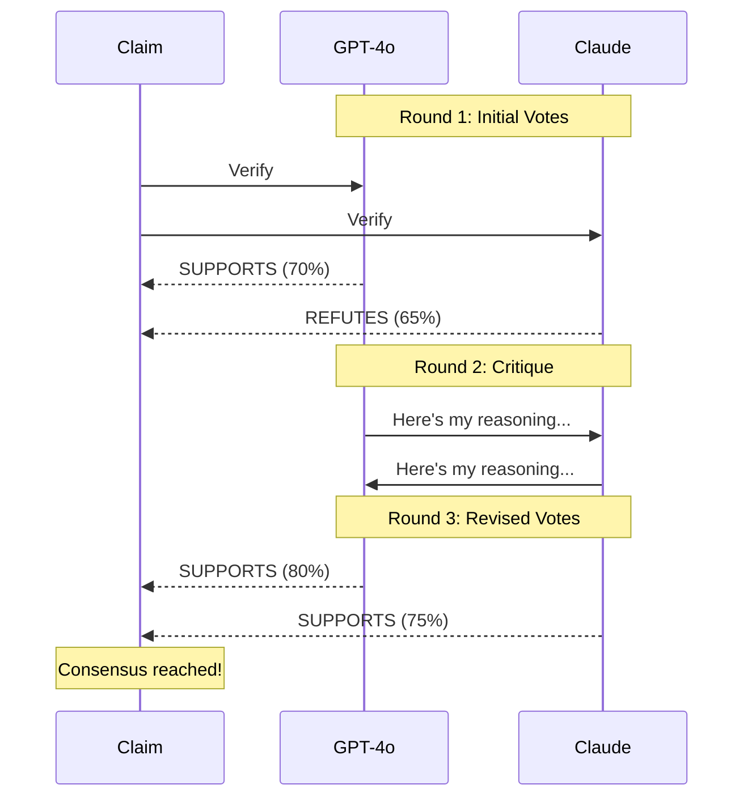

# Multi-Model Consensus

## Why Use Multiple Models?

Single models can hallucinate. Multiple models voting reduces false positives.

| Setup | Accuracy | Speed | Cost |
|-------|----------|-------|------|
| Single model | Good | Fast | Low |
| 2 models | Better | Medium | Medium |
| 3+ models | Best | Slow | Higher |

!!! example "When to Use Multi-Model"
    Use single model verification for quick checks and draft reviews where perfect accuracy isn't critical. Use 2-model consensus for production documentation that users depend on. Use 3+ models with high confidence thresholds for legal, medical, or safety-critical documentation where errors have serious consequences.

!!! tip "Model Selection Strategy"
    Pair models from different providers (GPT-4o + Claude) rather than different sizes from the same family (GPT-4o + GPT-4o-mini). Cross-provider diversity catches more hallucinations since models have different training data and architectures.

## Basic Consensus

```bash
truth-eval README.md \
  --model gpt-4o \
  --model gpt-4o-mini
```

## High-Confidence Setup

```bash
truth-eval critical-doc.md \
  --model gpt-4o \
  --model claude-sonnet-4-5 \
  --model gpt-4o-mini \
  --confidence 0.8
```

## How Consensus Works

### Agreement

```
gpt-4o: SUPPORTS
gpt-4o-mini: SUPPORTS
→ Final: SUPPORTS (high confidence)
```

### Disagreement

```
gpt-4o: SUPPORTS
gpt-4o-mini: REFUTES
→ Final: NOT_ENOUGH_INFO (conservative)
```

### Split Decision

```
gpt-4o: SUPPORTS
gpt-4o-mini: NOT_ENOUGH_INFO
claude: SUPPORTS
→ Final: SUPPORTS (majority)
```

## Python API

```python
from truthfulness_evaluator.chains.consensus import ConsensusChain

consensus = ConsensusChain(
    model_names=["gpt-4o", "gpt-4o-mini", "claude-sonnet-4-5"],
    weights={
        "gpt-4o": 0.4,
        "claude-sonnet-4-5": 0.4,
        "gpt-4o-mini": 0.2
    },
    confidence_threshold=0.7
)

result = await consensus.verify(claim, evidence)
print(result.model_votes)
# {'gpt-4o': 'SUPPORTS', 'gpt-4o-mini': 'SUPPORTS', 'claude-sonnet-4-5': 'SUPPORTS'}
```

## ICE (Iterative Consensus Ensemble)

!!! warning "Partial Implementation"
    The ICE critique and revision rounds are currently stubs. Round 1 (initial votes) works fully, but Rounds 2-3 (critique and revised votes) return placeholder results. Full ICE implementation is planned for a future release.

Models critique each other:

```python
from truthfulness_evaluator.chains.consensus import ICEConsensusChain

ice = ICEConsensusChain(
    model_names=["gpt-4o", "gpt-4o-mini"],
    max_rounds=3
)

result = await ice.verify(claim, evidence)
```

Round 1: Initial votes
Round 2: Review others' reasoning
Round 3: Final votes

Higher accuracy, 3x slower.

### ICE Multi-Round Process

The Iterative Consensus Ensemble (ICE) algorithm implements a debate-style verification process:



In Round 1, each model independently analyzes the evidence and casts an initial vote. In Round 2, models exchange their reasoning and critique each other's conclusions. In Round 3, models cast final votes after considering alternative perspectives. This process often resolves initial disagreements and produces higher-confidence verdicts.

### Real Consensus Output Examples

Here's what actual consensus output looks like with detailed model votes:

#### Example 1: Unanimous Agreement

```json
{
  "claim": "The create_truthfulness_graph() function returns a compiled StateGraph",
  "verdict": "SUPPORTS",
  "confidence": 0.93,
  "model_votes": {
    "gpt-4o": {
      "verdict": "SUPPORTS",
      "confidence": 0.95,
      "reasoning": "Function signature in src/graph.py line 142 shows return type CompiledGraph. Implementation calls compile() on StateGraph instance before returning."
    },
    "gpt-4o-mini": {
      "verdict": "SUPPORTS",
      "confidence": 0.91,
      "reasoning": "Source code confirms the function builds a StateGraph and returns the compiled result. Type hints match the claim."
    }
  },
  "consensus_method": "weighted_average",
  "key_evidence": ["src/truthfulness_evaluator/graph.py:142-156"]
}
```

#### Example 2: Disagreement Leading to NOT_ENOUGH_INFO

```json
{
  "claim": "Processing typically completes in under 10 seconds",
  "verdict": "NOT_ENOUGH_INFO",
  "confidence": 0.45,
  "model_votes": {
    "gpt-4o": {
      "verdict": "NOT_ENOUGH_INFO",
      "confidence": 0.50,
      "reasoning": "No performance benchmarks found in codebase. README mentions speed but provides no concrete timing data."
    },
    "gpt-4o-mini": {
      "verdict": "REFUTES",
      "confidence": 0.70,
      "reasoning": "Evidence suggests processing involves multiple LLM calls and web searches, which typically exceed 10 seconds total."
    }
  },
  "consensus_method": "conservative_on_disagreement",
  "flags": ["MODEL_DISAGREEMENT", "LOW_CONFIDENCE"],
  "key_evidence": []
}
```

#### Example 3: ICE Resolution After Initial Disagreement

```json
{
  "claim": "Requires Python 3.11 or higher",
  "verdict": "SUPPORTS",
  "confidence": 0.88,
  "model_votes": {
    "gpt-4o": {
      "initial_verdict": "SUPPORTS",
      "initial_confidence": 0.85,
      "final_verdict": "SUPPORTS",
      "final_confidence": 0.90,
      "reasoning": "pyproject.toml specifies requires-python = '>=3.11'. After reviewing alternative interpretation, I maintain this is correct."
    },
    "claude-sonnet-4-5": {
      "initial_verdict": "REFUTES",
      "initial_confidence": 0.65,
      "final_verdict": "SUPPORTS",
      "final_confidence": 0.86,
      "reasoning": "Initially misread version constraint. After critique, confirmed pyproject.toml does require 3.11+. Changed verdict."
    }
  },
  "consensus_method": "ice",
  "rounds": 3,
  "key_evidence": ["pyproject.toml:10"]
}
```

## When to Use

| Scenario | Recommendation |
|----------|----------------|
| Quick check | Single model (gpt-4o) |
| Documentation | 2 models |
| Legal/medical | 3+ models + high threshold |
| Research paper | ICE consensus |

## Cost Optimization

```python
# Cheap extraction, expensive verification
config = EvaluatorConfig(
    extraction_model="gpt-4o-mini",  # $0.15/M tokens
    verification_models=["gpt-4o"],   # $2.50/M tokens
)
```

## Interpreting Disagreements

```
Claim: "Feature X was added in v2.0"

gpt-4o: SUPPORTS
gpt-4o-mini: REFUTES

→ Check:
- Different evidence sources?
- Ambiguous wording?
- Outdated information?
```

Disagreement = need for human review.

!!! warning "Common Disagreement Causes"
    Models often disagree when evidence is ambiguous, sources contradict each other, or claims use imprecise language. For example, "supports Python 3.11" could mean "requires 3.11+" or "works with 3.11 among other versions". Rewrite ambiguous claims more precisely to reduce disagreement.

## Advanced Consensus Strategies

### Confidence Thresholds

Set minimum confidence to accept verdicts:

```python
consensus = ConsensusChain(
    model_names=["gpt-4o", "gpt-4o-mini"],
    confidence_threshold=0.85  # Reject verdicts below 85%
)
```

Low-confidence results trigger human review or additional evidence gathering.

### Weighted Voting

Assign different weights to models based on their reliability:

```python
consensus = ConsensusChain(
    model_names=["gpt-4o", "claude-sonnet-4-5", "gpt-4o-mini"],
    weights={
        "gpt-4o": 0.4,          # 40% weight - strong general reasoning
        "claude-sonnet-4-5": 0.4,  # 40% weight - excellent code understanding
        "gpt-4o-mini": 0.2      # 20% weight - faster but less accurate
    }
)
```

The final confidence score is the weighted average of individual model confidences.

### Tie-Breaking Rules

When models are split evenly (2 SUPPORTS, 2 REFUTES):

1. **Conservative** (default): Return NOT_ENOUGH_INFO
2. **Optimistic**: Return majority verdict if confidence > threshold
3. **Defer**: Trigger human review interrupt

Configure in `ConsensusConfig`:

```python
config = ConsensusConfig(
    tie_break_strategy="conservative",  # or "optimistic", "defer"
    defer_confidence_threshold=0.75
)
```

!!! tip "Choosing Tie-Break Strategy"
    Use conservative for production documentation verification where false positives are costly. Use optimistic for draft reviews where you want to catch obvious errors but accept some uncertainty. Use defer for critical documents where every claim must be verified by humans.
