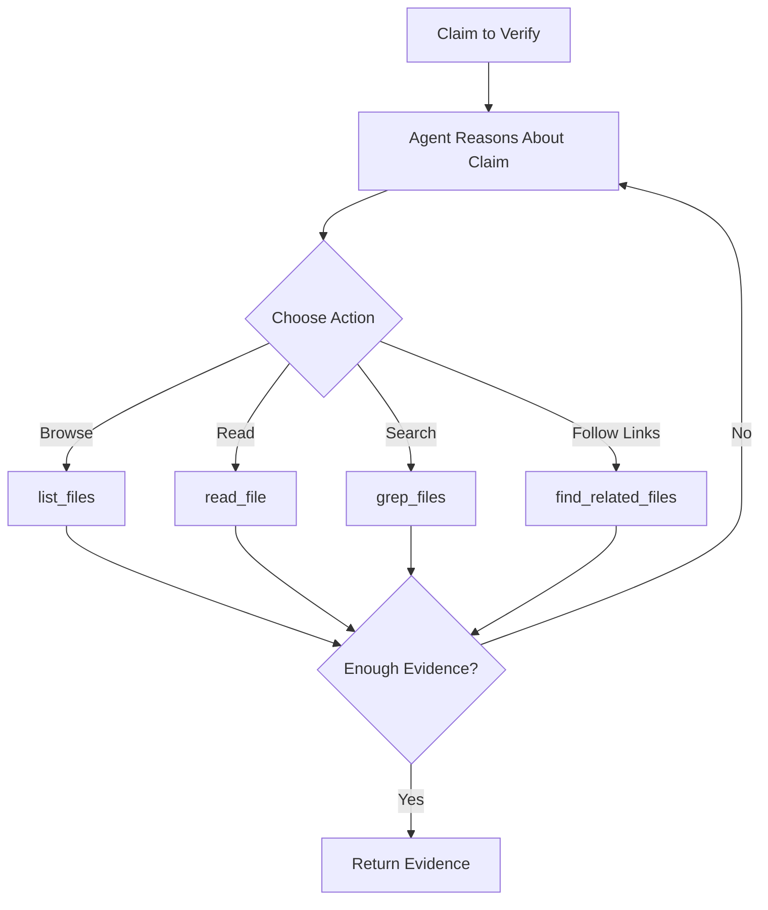

# Filesystem Evidence

## When to Use

Verify documentation against actual code:

- README claims about API behavior
- Version requirements in docs
- Feature descriptions
- Installation instructions

!!! example "Perfect for Documentation Drift Detection"
    Run filesystem verification in CI to catch when code changes break documentation. For example, if a function signature changes from `process(data)` to `process(data, options)`, the agent will detect the mismatch and flag the claim as refuted.

!!! tip "Scoping the Root Path"
    Set `--root-path ./src` to limit the agent to source code only, speeding up verification and avoiding false matches in test fixtures or example code. For full-repo verification including tests and configs, use `--root-path .`

## Basic Usage

```bash
truth-eval README.md --root-path .
```

## How It Works

The React agent uses these tools:

| Tool | Purpose |
|------|---------|
| `list_files` | Browse directory structure |
| `read_file` | Read source files |
| `grep_files` | Search for patterns |
| `find_related_files` | Follow imports/links |

### React Agent Decision Loop

The filesystem agent implements a ReAct (Reasoning + Acting) loop to intelligently gather evidence:



The agent starts by reasoning about what evidence would verify the claim, then chooses appropriate tools to gather it. After each action, the agent evaluates whether enough evidence has been collected or if additional exploration is needed. This continues until sufficient evidence is found or a maximum iteration limit is reached.

For example, to verify "The process() function accepts a DataFrame", the agent might:

1. **Reason**: "I need to find the process() function definition"
2. **Act**: `grep_files("def process", "*.py")`
3. **Observe**: Found in `src/core.py:45`
4. **Reason**: "Now I need to read the full signature"
5. **Act**: `read_file("src/core.py", start_line=45, end_line=60)`
6. **Observe**: Signature shows `def process(data: Union[DataFrame, dict], ...)`
7. **Reason**: "Evidence confirms the claim"
8. **Return**: Evidence with high relevance score

## Example: API Documentation

README claims:
```markdown
## API

The `process()` function accepts:
- `data`: DataFrame or dict
- `batch_size`: Integer, default 100
- Returns: Processed DataFrame
```

Verification:
```bash
truth-eval README.md --root-path ./src
```

Agent actions:
1. Search for `process` function definition
2. Read function signature
3. Check parameter types
4. Verify return type

Detailed agent execution trace:

```
🤖 Agent Step 1: Reasoning
   → Need to locate the process() function definition

🔧 Agent Step 1: Action
   → grep_files(pattern="def process", file_pattern="**/*.py")

📄 Agent Step 1: Observation
   → Found 1 match: src/core.py:45

🤖 Agent Step 2: Reasoning
   → Need to read the full function signature and docstring

🔧 Agent Step 2: Action
   → read_file(path="src/core.py", start_line=45, end_line=65)

📄 Agent Step 2: Observation
   → def process(data: Union[DataFrame, dict], batch_size: int = 100) -> Union[DataFrame, dict]:

🤖 Agent Step 3: Reasoning
   → Evidence confirms data accepts DataFrame or dict, batch_size defaults to 100
   → Return type is Union, not just DataFrame - partial match only

✅ Agent Step 3: Complete
   → Returning 2 evidence pieces with relevance scores
```

Result:
```
✅ process() accepts DataFrame or dict → SUPPORTS (95% confidence)
   📁 Evidence: src/core.py:45

✅ batch_size default 100 → SUPPORTS (100% confidence)
   📁 Evidence: src/core.py:45 (def process(..., batch_size: int = 100))

⚠️  Returns DataFrame → NOT_ENOUGH_INFO (60% confidence)
   📁 Evidence: src/core.py:45 (returns Union[DataFrame, dict], not just DataFrame)
   🗳️  Model votes: gpt-4o: REFUTES, gpt-4o-mini: NOT_ENOUGH_INFO
   💡 Recommendation: Update docs to mention dict is also a possible return type
```

## Example: Version Requirements

README:
```markdown
Requires Python 3.11 or higher.
```

```bash
truth-eval README.md --root-path .
```

Agent execution:

```
🤖 Agent Step 1: Reasoning
   → Python version requirements typically in pyproject.toml or setup.py

🔧 Agent Step 1: Action
   → list_files(path=".", pattern="*.toml")

📄 Agent Step 1: Observation
   → Found: pyproject.toml, uv.lock

🔧 Agent Step 2: Action
   → read_file(path="pyproject.toml")

📄 Agent Step 2: Observation
   → requires-python = ">=3.11"
   → [project] section confirms minimum version

🤖 Agent Step 3: Reasoning
   → Found exact match in dependency specification
   → Should verify CI pipeline matches

🔧 Agent Step 3: Action
   → read_file(path=".github/workflows/ci.yml")

📄 Agent Step 3: Observation
   → python-version: ['3.11', '3.12', '3.13']
   → CI tests against 3.11 minimum

✅ Agent Step 4: Complete
   → Multiple sources confirm Python 3.11+ requirement
```

Result:
```
✅ Requires Python 3.11 or higher → SUPPORTS (98% confidence)
   📁 Evidence:
      • pyproject.toml:10 (requires-python = ">=3.11")
      • .github/workflows/ci.yml:18 (python-version: ['3.11', '3.12', '3.13'])
   🗳️  Votes: gpt-4o: SUPPORTS, gpt-4o-mini: SUPPORTS
```

## Example: Feature Claims

README:
```markdown
Supports async/await patterns for concurrent processing.
```

Agent execution:

```
🤖 Agent Step 1: Reasoning
   → Looking for async function definitions and await usage

🔧 Agent Step 1: Action
   → grep_files(pattern="async def", file_pattern="**/*.py")

📄 Agent Step 1: Observation
   → Found 23 matches across 8 files:
      • src/graph.py: async def ainvoke
      • src/chains/verification.py: async def verify
      • src/agents/evidence_agent.py: async def search
      • ...

🤖 Agent Step 2: Reasoning
   → Multiple async functions found, need to verify concurrent processing claim

🔧 Agent Step 2: Action
   → grep_files(pattern="asyncio.gather|await.*await", file_pattern="**/*.py")

📄 Agent Step 2: Observation
   → Found concurrent patterns in src/chains/verification.py:
      • results = await asyncio.gather(*[model.verify(...) for model in models])

🤖 Agent Step 3: Reasoning
   → Evidence confirms both async/await support AND concurrent processing

✅ Agent Step 3: Complete
   → Claim fully supported by codebase
```

Result:
```
✅ Supports async/await patterns → SUPPORTS (95% confidence)
   📁 Evidence:
      • src/graph.py:45 (async def ainvoke)
      • src/chains/verification.py:78 (async def verify)
      • 21 other async functions found

✅ Concurrent processing → SUPPORTS (92% confidence)
   📁 Evidence:
      • src/chains/verification.py:112 (asyncio.gather for parallel verification)
   🗳️  Votes: gpt-4o: SUPPORTS, gpt-4o-mini: SUPPORTS
```

## Python API

```python
from truthfulness_evaluator.evidence.agent import FilesystemEvidenceAgent

agent = FilesystemEvidenceAgent(root_path="./src")
evidence = await agent.search("process function accepts DataFrame")

for e in evidence:
    print(f"{e['file_path']}: {e['content'][:100]}")
```

## Custom File Patterns

Edit `tools/filesystem.py` to add patterns:

```python
@tool
def grep_files(pattern: str, file_pattern: str = "*.py"):
    """Search in Python files by default"""
    ...
```

## Security

Agent is scoped to `root_path`:

```python
# Safe
agent = FilesystemEvidenceAgent(root_path="./project")

# Blocks access to parent directories
agent.read_file("../../etc/passwd")  # Error: Outside allowed directory
```

## Performance Tips

| Issue | Solution |
|-------|----------|
| Large repos | Exclude `node_modules/`, `.git/` |
| Slow search | Limit file size checks |
| Many files | Use specific file patterns |

## Troubleshooting

### No Evidence Found

```bash
# Check root path is correct
truth-eval README.md --root-path ./src  # Not just .

# Verify files exist
ls ./src/*.py
```

### Wrong Files Read

The agent uses LLM reasoning to select files. If it picks wrong files:

1. Improve claim specificity
2. Add more context to README
3. Use explicit file references

### CI Integration

```yaml
- name: Verify docs match code
  run: |
    truth-eval README.md --root-path . --confidence 0.8
    truth-eval API.md --root-path ./src --confidence 0.8
```
