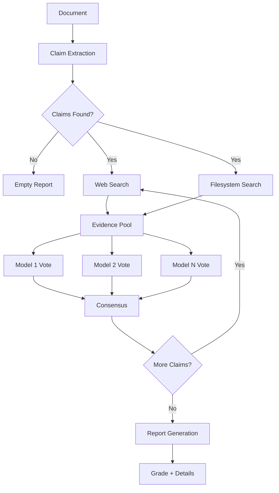

# Truthfulness Evaluator

Multi-model truthfulness evaluation with filesystem-aware evidence gathering.

## Overview

Documentation drifts from reality. READMEs describe APIs that no longer exist, blog posts contain outdated version requirements, and AI-generated content includes plausible-sounding hallucinations. Manual fact-checking doesn't scale — a single README can contain dozens of verifiable claims about dependencies, APIs, configuration defaults, and behavioral guarantees.

Truthfulness Evaluator automates this end-to-end. It extracts factual claims from your documents, gathers evidence from both web searches and your actual codebase, then uses multiple AI models to independently verify each claim through weighted consensus. The output is a graded report (A+ to F) with evidence citations, confidence scores, and detailed explanations.

```bash
truth-eval README.md --root-path .
```

```
Grade: A+
Confidence: 91.7%
✅ 3 claims verified
```

!!! info "Who It's For"

    **Developers** maintaining open source projects who need confidence that READMEs accurately describe installation steps, API signatures, and version requirements.

    **Technical writers** producing documentation, tutorials, and guides who need to verify factual claims without manually testing every statement.

    **Content teams** publishing technical content who need automated fact-checking that catches hallucinations and outdated information before it reaches readers.

    **CI/CD pipelines** that enforce documentation quality by failing builds when claims can't be verified, treating docs-code consistency as a first-class requirement.

## Key Features

- **Multi-Model Consensus** — GPT-4o, Claude, and others vote on verdicts
- **Pluggable Architecture** — Protocol-based adapters for custom extractors, gatherers, verifiers, and formatters
- **Internal Verification** — Check documentation against actual codebase
- **Filesystem Evidence** — React agent browses your project for supporting docs
- **Web Search** — DuckDuckGo integration for external verification
- **Structured Outputs** — Pydantic models throughout, no brittle JSON parsing
- **Rich Reports** — JSON, Markdown, and HTML output formats
- **LangGraph 1.0+** — Durable execution with checkpointing and streaming

## How It Works



1. **Claim Extraction** — LLM parses the document and extracts verifiable factual statements as structured Pydantic models, skipping opinions and predictions.
2. **Evidence Gathering** — For each claim, the system searches multiple sources in parallel: web search for external facts, and a filesystem React agent for code-specific claims.
3. **Multi-Model Verification** — Each claim is sent to multiple AI models independently. Models return structured verdicts (SUPPORTS, REFUTES, or NOT_ENOUGH_INFO) with confidence scores.
4. **Consensus & Grading** — Model votes are aggregated through weighted consensus. The final report includes a letter grade (A+ to F), evidence citations, and detailed explanations.

For a deeper look at the pipeline, see the [Architecture Overview](architecture/overview.md).

## Example Output

```
Truthfulness Evaluation Report
Grade: A | Overall Confidence: 87.3%

Extracted 5 claims from README.md

✅ SUPPORTED (95% confidence)
   Claim: "Requires Python 3.11 or higher"
   Votes: gpt-4o: SUPPORTS, gpt-4o-mini: SUPPORTS
   Evidence: pyproject.toml (requires-python = ">=3.11")

✅ SUPPORTED (92% confidence)
   Claim: "Built on LangGraph 1.0+ and LangChain 1.0+"
   Votes: gpt-4o: SUPPORTS, gpt-4o-mini: SUPPORTS
   Evidence: pyproject.toml (langgraph = "^1.0.0")

❌ REFUTED (90% confidence)
   Claim: "Supports JavaScript and TypeScript codebases"
   Votes: gpt-4o: REFUTES, gpt-4o-mini: REFUTES
   Evidence: Only Python file parsing found

Summary: 3 supported, 1 refuted, 1 needs review
```

## Quick Start

```bash
pip install truthfulness-evaluator
export OPENAI_API_KEY="sk-..."
truth-eval document.md

# Generate markdown report
truth-eval document.md -o report.md

# Internal verification (check docs against code)
truth-eval README.md --root-path . --mode both
```

## Next Steps

- [Installation](getting-started/installation.md) — Set up in 5 minutes
- [Quick Start](getting-started/quickstart.md) — Run your first evaluation
- [Architecture](architecture/overview.md) — System design and pluggable workflows
- [CLI Reference](usage/cli.md) — Command-line options
