# Truthfulness Evaluator

Multi-model truthfulness evaluation with filesystem-aware evidence gathering.

## What It Does

Verifies factual claims in documents using multiple AI models and real-world evidence.

```bash
truth-eval README.md --root-path .
```

```
Grade: A+
Confidence: 91.7%
✅ 3 claims verified
```

## The Problem

Documentation drifts from reality. READMEs describe APIs that no longer exist. Blog posts contain outdated version requirements. AI-generated content includes plausible-sounding hallucinations. Technical claims go unverified until users discover them broken.

Manual fact-checking doesn't scale. A single README might contain dozens of verifiable claims about dependencies, APIs, configuration defaults, and behavioral guarantees. Each claim requires hunting through codebases, checking changelogs, and cross-referencing documentation. By the time you finish, the code has changed again.

Traditional linting catches syntax errors. Static analysis finds type mismatches. But nothing automatically verifies that your documentation matches reality—that the `timeout` parameter really defaults to 30 seconds, that Python 3.11 is actually required, or that the function signature you documented still exists.

## The Solution

Truthfulness Evaluator automates the fact-checking pipeline end-to-end. It extracts factual claims from your documentation, gathers evidence from both web searches and your actual codebase, then uses multiple AI models to independently verify each claim. Models vote on verdicts through weighted consensus, surfacing high-confidence results and flagging disagreements for human review.

The tool routes claims intelligently: external facts like "Python was created in 1991" trigger web searches, while code-specific claims like "process() accepts a DataFrame" trigger filesystem exploration. A React agent browses your project structure, reads source files, and follows imports to gather supporting evidence. Multiple models analyze the same evidence independently, reducing hallucination risk through ensemble verification.

The output is a graded report (A+ to F) with detailed explanations, confidence scores, and evidence citations. Run it in CI to catch documentation drift before merge. Use it for content review before publishing. Integrate it into technical writing workflows to verify claims as you write them.

## Who It's For

**Developers** maintaining open source projects need confidence that READMEs accurately describe installation steps, API signatures, and version requirements. Run this before cutting releases to catch documentation drift.

**Technical writers** producing documentation, tutorials, and guides need to verify factual claims about software behavior, configuration, and requirements without manually testing every statement.

**Content teams** publishing AI-generated or human-written technical content need automated fact-checking that catches hallucinations, outdated information, and unverified claims before they reach readers.

**CI/CD pipelines** can enforce documentation quality by failing builds when claims can't be verified, treating docs-code consistency as a first-class requirement alongside tests and linting.

## Key Features

- **Multi-Model Consensus** — GPT-4o, Claude, and others vote on verdicts
- **Pluggable Architecture** — Protocol-based adapters for custom extractors, gatherers, verifiers, and formatters
- **Internal Verification** — Check documentation against actual codebase
- **Filesystem Evidence** — React agent browses your project for supporting docs
- **Web Search** — DuckDuckGo integration for external verification
- **Structured Outputs** — Pydantic models throughout, no brittle JSON parsing
- **Rich Reports** — JSON, Markdown, and HTML output formats
- **LangGraph 1.0+** — Durable execution with checkpointing and streaming

## Quick Start

```bash
pip install truthfulness-evaluator
export OPENAI_API_KEY="sk-..."
truth-eval document.md

# Generate markdown report
truth-eval document.md -o report.md

# Internal verification (check docs against code)
truth-eval README.md --root-path . --mode both
```

## How It Works

```mermaid
graph TD
    A[📄 Document] --> B[🔍 Claim Extraction]
    B --> C{Claims Found?}
    C -->|No| D[Empty Report]
    C -->|Yes| E[🌐 Web Search]
    C -->|Yes| F[📁 Filesystem Search]
    E --> G[📊 Evidence Pool]
    F --> G
    G --> H[🤖 Model 1 Vote]
    G --> I[🤖 Model 2 Vote]
    G --> J[🤖 Model N Vote]
    H --> K[🗳️ Consensus]
    I --> K
    J --> K
    K --> L{More Claims?}
    L -->|Yes| E
    L -->|No| M[📋 Report Generation]
    M --> N[Grade + Details]
```



## Architecture Overview

### Claim Extraction

The pipeline begins by parsing the input document to identify verifiable factual statements. An LLM extracts claims as structured Pydantic models, classifying each as explicit (directly stated), implicit (reasonably inferred), or inferred (requires domain knowledge). The extractor skips opinions, predictions, and subjective statements, focusing only on falsifiable claims about observable facts, API behavior, configuration, or requirements.

### Evidence Gathering

For each extracted claim, the system searches multiple sources in parallel. Web search uses DuckDuckGo to find supporting or refuting information from public sources. Filesystem search employs a React agent that browses the local codebase, using tools like `list_files`, `read_file`, and `grep_files` to locate relevant source code, configuration files, and documentation. Evidence is scored by relevance and credibility, then ranked to surface the most useful sources.

### Multi-Model Verification

Each claim and its evidence pool is sent to multiple AI models independently. Models analyze the evidence and return structured verdicts: SUPPORTS (evidence confirms the claim), REFUTES (evidence contradicts it), or NOT_ENOUGH_INFO (insufficient evidence for a determination). Each verdict includes confidence scores and detailed reasoning explaining how the evidence led to the conclusion.

### Consensus

Model votes are aggregated through weighted consensus. Unanimous votes produce high-confidence results. Disagreements trigger conservative fallbacks: if models contradict each other, the system returns NOT_ENOUGH_INFO rather than guessing. Optional ICE (Iterative Consensus Ensemble) mode adds critique rounds where models review each other's reasoning before casting final votes, improving accuracy at the cost of latency.

### Report Generation

The final report aggregates all claim verdicts into a letter grade (A+ to F) based on the percentage of supported claims and average confidence. Output formats include JSON (machine-readable), Markdown (human-readable), and HTML (presentation-ready). Reports include evidence citations, model vote breakdowns, and detailed explanations for each claim, making it easy to understand why verdicts were reached.

## Example Output

Here's what a complete verification looks like for a typical README:

```
📊 Truthfulness Evaluation Report
━━━━━━━━━━━━━━━━━━━━━━━━━━━━━━━━━━━━━━━━━━━━━━━━━━━━━━━━━━━━━
Grade: A | Overall Confidence: 87.3%
━━━━━━━━━━━━━━━━━━━━━━━━━━━━━━━━━━━━━━━━━━━━━━━━━━━━━━━━━━━━━

📋 Extracted 5 claims from README.md

✅ SUPPORTED (92% confidence)
   Claim: "Built on LangGraph 1.0+ and LangChain 1.0+"
   🗳️  Votes: gpt-4o: SUPPORTS, gpt-4o-mini: SUPPORTS
   📁 Evidence: pyproject.toml (langgraph = "^1.0.0")

✅ SUPPORTED (95% confidence)
   Claim: "Requires Python 3.11 or higher"
   🗳️  Votes: gpt-4o: SUPPORTS, gpt-4o-mini: SUPPORTS
   📁 Evidence: pyproject.toml (requires-python = ">=3.11")
   🌐 Web: python.org/downloads confirms 3.11 release date

✅ SUPPORTED (88% confidence)
   Claim: "Returns structured Pydantic models throughout"
   🗳️  Votes: gpt-4o: SUPPORTS, gpt-4o-mini: SUPPORTS
   📁 Evidence: src/models/verification.py (VerificationOutput extends BaseModel)

⚠️  NOT_ENOUGH_INFO (65% confidence)
   Claim: "Processes documents in under 30 seconds"
   🗳️  Votes: gpt-4o: NOT_ENOUGH_INFO, gpt-4o-mini: REFUTES
   📁 Evidence: No performance benchmarks found in codebase
   ⚠️  Model disagreement detected - manual review recommended

❌ REFUTED (90% confidence)
   Claim: "Supports JavaScript and TypeScript codebases"
   🗳️  Votes: gpt-4o: REFUTES, gpt-4o-mini: REFUTES
   📁 Evidence: Only Python file parsing found in src/tools/filesystem.py

━━━━━━━━━━━━━━━━━━━━━━━━━━━━━━━━━━━━━━━━━━━━━━━━━━━━━━━━━━━━━
Summary: 3 supported, 1 refuted, 1 needs review
Grade Breakdown:
  • Accuracy: 60% claims fully supported
  • Confidence: 87.3% average across all verdicts
  • Recommendations: Review claim 4, update claim 5 in documentation
━━━━━━━━━━━━━━━━━━━━━━━━━━━━━━━━━━━━━━━━━━━━━━━━━━━━━━━━━━━━━
```

## When to Use

| Use Case | Why It Helps |
|----------|--------------|
| Documentation review | Catch outdated claims in READMEs |
| Technical writing | Verify API claims against code |
| Content validation | Fact-check blog posts before publishing |
| Code review | Validate comments and docstrings |

!!! tip "Best Use Cases"
    The tool excels at verifying factual claims that can be checked against external evidence. It works best on technical documentation, API references, version requirements, and configuration details. For subjective claims like "easy to use" or future predictions, the tool will correctly skip them as non-verifiable.

!!! warning "Limitations"
    While multi-model consensus reduces hallucination risk, the tool cannot verify claims that require runtime execution, access to private systems, or domain expertise beyond the models' training data. Always review low-confidence verdicts manually.

## How Grading Works

The final report grade (A+ to F) is calculated based on two factors:

1. **Accuracy**: Percentage of claims that received SUPPORTS verdicts
2. **Confidence**: Average confidence score across all verdicts

| Grade | Accuracy | Avg Confidence | Interpretation |
|-------|----------|----------------|----------------|
| A+ | 90-100% | 85%+ | Excellent - Documentation highly accurate |
| A | 80-89% | 80%+ | Very good - Minor issues only |
| B | 70-79% | 70%+ | Good - Some claims need revision |
| C | 60-69% | 60%+ | Acceptable - Several claims questionable |
| D | 50-59% | 50%+ | Poor - Many claims unsupported |
| F | <50% | <50% | Failing - Documentation unreliable |

!!! note "Grade Modifiers"
    Grades can include + or - modifiers based on the mix of supported, refuted, and uncertain claims. A document with 85% accuracy but several refuted claims scores lower than one with 85% accuracy and only NOT_ENOUGH_INFO verdicts.

!!! warning "NOT_ENOUGH_INFO Impact"
    Claims with NOT_ENOUGH_INFO verdicts count against the grade but less severely than REFUTES verdicts. They indicate insufficient evidence rather than provably false statements. Review these claims manually to determine if they need clarification or additional evidence.

## Next Steps

- [Installation](getting-started/installation.md) — Set up in 5 minutes
- [Quick Start](getting-started/quickstart.md) — Run your first evaluation
- [Architecture](architecture/overview.md) — System design and pluggable workflows
- [CLI Reference](usage/cli.md) — Command-line options
