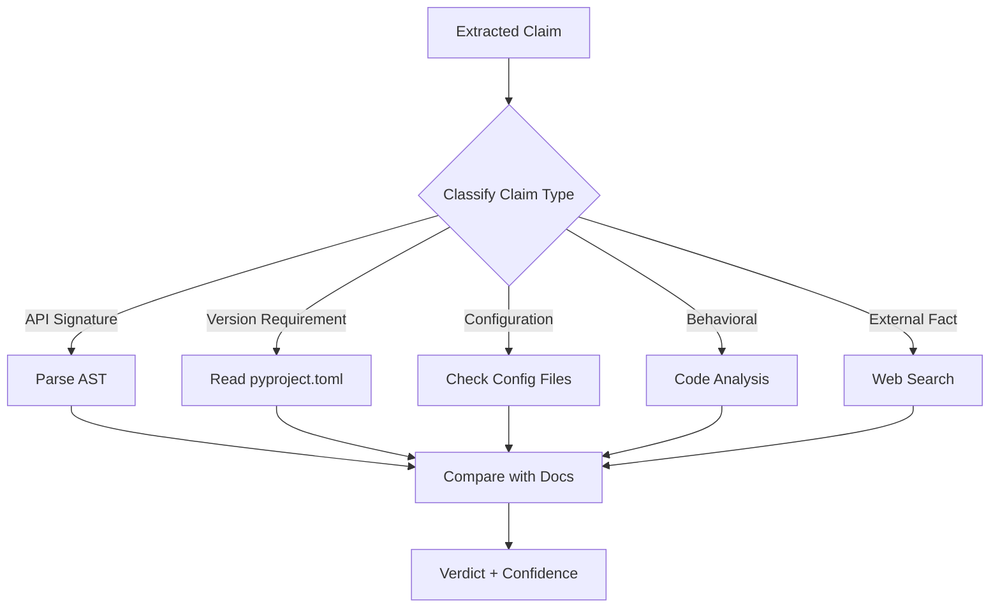

# Internal Verification

Verify documentation against your actual codebase.

## Overview

Internal verification checks if your documentation accurately describes your code:

- API signatures match implementation
- Version requirements are correct
- Configuration defaults are accurate
- Behavioral claims are true

!!! tip "Internal vs External Verification"
    Use `--mode internal` when verifying documentation against your codebase. Use `--mode external` for fact-checking blog posts or general technical writing. Use `--mode both` to automatically route claims to the appropriate verifier based on content.

!!! warning "Static Analysis Limitations"
    Internal verification uses static code analysis and cannot verify runtime behavior, performance claims, or functionality that depends on external systems. Claims like "processes 1000 requests per second" require benchmark testing, not static analysis.

## When to Use

| Scenario | External | Internal |
|----------|----------|----------|
| "Python was created in 1991" | ✅ Web search | ❌ N/A |
| "The `process()` function accepts a DataFrame" | ❌ N/A | ✅ Check code |
| "Requires Python 3.11+" | ❌ N/A | ✅ Check pyproject.toml |
| "Default timeout is 30 seconds" | ❌ N/A | ✅ Check config.py |

## Basic Usage

```bash
# Verify README against codebase
truth-eval README.md --root-path . --mode internal
```

## Combined Mode

Automatically route claims to appropriate verifier:

```bash
# External facts → Web search
# Code claims → Codebase verification
truth-eval README.md --root-path . --mode both
```

## How It Works

### 1. Claim Classification

The tool classifies each claim:

| Type | Example | Verification Method |
|------|---------|---------------------|
| `external_fact` | "Python created 1991" | Web search |
| `api_signature` | "process() accepts DataFrame" | Parse function signature |
| `version_requirement` | "Requires Python 3.11+" | Read pyproject.toml |
| `configuration` | "Default port is 8080" | Check config files |
| `behavioral` | "Returns data in 5 seconds" | Code analysis |

### Claim Classification and Routing

The system automatically routes claims to appropriate verification strategies:



Claims about API signatures trigger Abstract Syntax Tree (AST) parsing to extract function definitions and type signatures. Version requirements route to dependency files like `pyproject.toml` or `setup.py`. Configuration claims search config modules and YAML/JSON files. Behavioral claims analyze code patterns and logic. External facts fallback to web search when no internal evidence exists.

### 2. Evidence Gathering

Smart file selection based on claim type:

```python
# API claims → Search src/**/*.py
# Version claims → Check pyproject.toml, setup.py
# Config claims → Check config.py, settings.yaml
```

### 3. Multi-Modal Confidence

Low confidence triggers second opinion:

```
Model 1: REFUTES (confidence: 60%)
    ↓
Get second opinion
    ↓
Model 2: SUPPORTS (confidence: 90%)
    ↓
Consensus: NOT_ENOUGH_INFO (disagreement)
```

## Example

**Documentation:**
```markdown
## API

The `create_truthfulness_graph()` function returns a compiled LangGraph.
Requires Python 3.11 or higher.
```

**Verification:**
```bash
truth-eval README.md --root-path . --mode both
```

**Output:**
```
📋 Extracted 2 claims
  - "create_truthfulness_graph() returns..." → api_signature
  - "Requires Python 3.11+" → version_requirement

✅ create_truthfulness_graph() returns... → SUPPORTS (100%)
   📁 Evidence: src/truthfulness_evaluator/graph.py
   
✅ Requires Python 3.11+ → SUPPORTS (95%)
   📁 Evidence: pyproject.toml
```

## Confidence-Based Routing

| Confidence | Action |
|------------|--------|
| >= 85% | Accept verdict |
| 60-85% | Get second opinion |
| < 60% | Mark as NEI |

## Limitations

- **Python only** (currently) - JS/TS/Rust coming soon
- **Static analysis** - Can't verify runtime behavior
- **Function discovery** - May miss functions in nested modules

## Python API

```python
from truthfulness_evaluator.graph_internal import create_internal_verification_graph

graph = create_internal_verification_graph()

result = await graph.ainvoke({
    "document": readme_content,
    "document_path": "README.md",
    "root_path": ".",
    "verification_mode": "both",  # or "internal" or "external"
    # ... other state
})
```

## Real-World Examples

### Example 1: Outdated API Documentation

**README.md:**
```markdown
The `authenticate(username, password)` function verifies user credentials.
```

**Actual Code (src/auth.py):**
```python
async def authenticate(username: str, password: str, mfa_token: str | None = None) -> AuthResult:
    """Verify user credentials with optional MFA."""
```

**Verification Result:**
```
⚠️  NOT_ENOUGH_INFO (70% confidence)
   Claim: "authenticate(username, password) function"
   📁 Evidence: src/auth.py:45 shows authenticate() now requires optional mfa_token parameter
   🗳️  Votes: gpt-4o: REFUTES, gpt-4o-mini: NOT_ENOUGH_INFO
   💡 Recommendation: Update docs to mention MFA support
```

The tool correctly identified that the documentation is outdated - while the core claim is still true, the function signature has evolved.

### Example 2: Configuration Default Mismatch

**README.md:**
```markdown
The default timeout is 30 seconds.
```

**Actual Code (src/config.py):**
```python
DEFAULT_TIMEOUT = 60  # seconds
```

**Verification Result:**
```
❌ REFUTES (95% confidence)
   Claim: "default timeout is 30 seconds"
   📁 Evidence: src/config.py:12 (DEFAULT_TIMEOUT = 60)
   🗳️  Votes: gpt-4o: REFUTES, gpt-4o-mini: REFUTES
   💡 Recommendation: Update docs to reflect 60 second timeout
```

Clear refutation with high confidence - the documented value doesn't match the code.

### Example 3: Accurate Version Requirement

**README.md:**
```markdown
Requires Python 3.11+ for native TOML support.
```

**Verification Result:**
```
✅ SUPPORTS (96% confidence)
   Claim: "Requires Python 3.11+"
   📁 Evidence:
      • pyproject.toml:8 (requires-python = ">=3.11")
      • src/__init__.py uses tomllib (stdlib in 3.11+)
   🗳️  Votes: gpt-4o: SUPPORTS, gpt-4o-mini: SUPPORTS
```

The agent verified both the declared requirement AND the reason (TOML support), increasing confidence.

## CI Integration

```yaml
- name: Verify docs match code
  run: |
    truth-eval README.md --root-path . --mode both --confidence 0.8
    truth-eval API.md --root-path ./src --mode internal
```

### GitHub Actions Example

```yaml
name: Documentation Verification

on: [pull_request]

jobs:
  verify-docs:
    runs-on: ubuntu-latest
    steps:
      - uses: actions/checkout@v4

      - name: Set up Python
        uses: actions/setup-python@v5
        with:
          python-version: '3.11'

      - name: Install truthfulness-evaluator
        run: pip install truthfulness-evaluator

      - name: Verify README
        env:
          OPENAI_API_KEY: ${{ secrets.OPENAI_API_KEY }}
        run: |
          truth-eval README.md \
            --root-path . \
            --mode both \
            --confidence 0.80 \
            --output report.json

      - name: Check grade
        run: |
          GRADE=$(jq -r '.grade' report.json)
          if [[ "$GRADE" == "C" || "$GRADE" == "D" || "$GRADE" == "F" ]]; then
            echo "Documentation quality too low: $GRADE"
            exit 1
          fi

      - name: Upload report
        uses: actions/upload-artifact@v4
        with:
          name: verification-report
          path: report.json
```

This workflow fails the build if documentation quality drops below a B grade.

!!! tip "CI Performance Optimization"
    Cache model responses between runs using `--cache-dir .truth-eval-cache` to speed up verification for unchanged claims. This reduces API costs and latency for large documentation suites.
