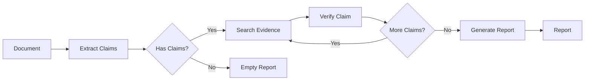
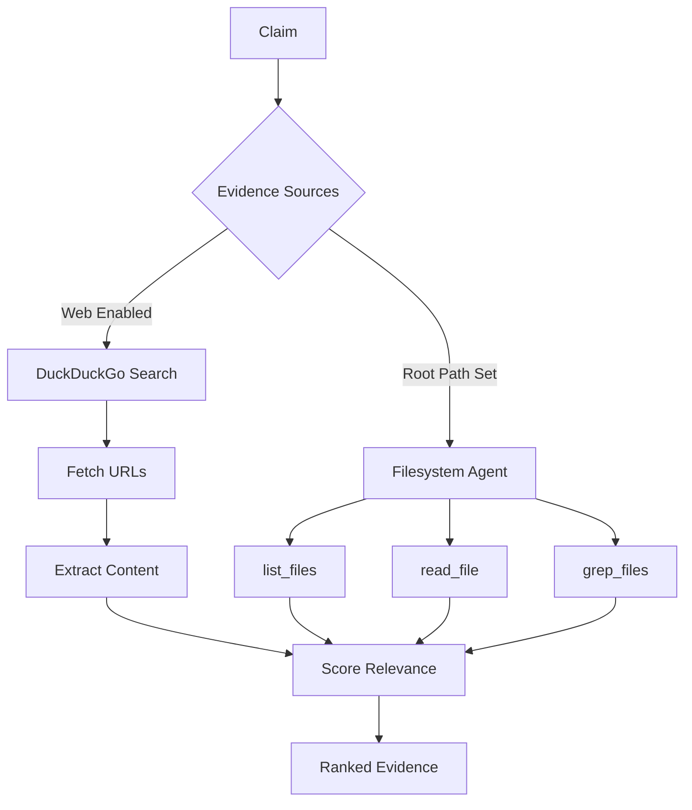
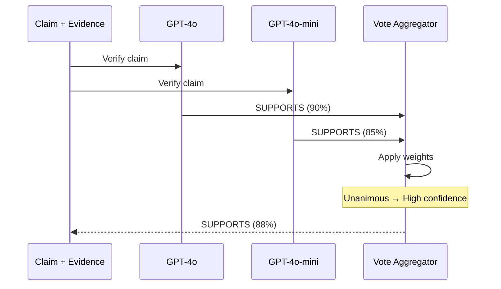
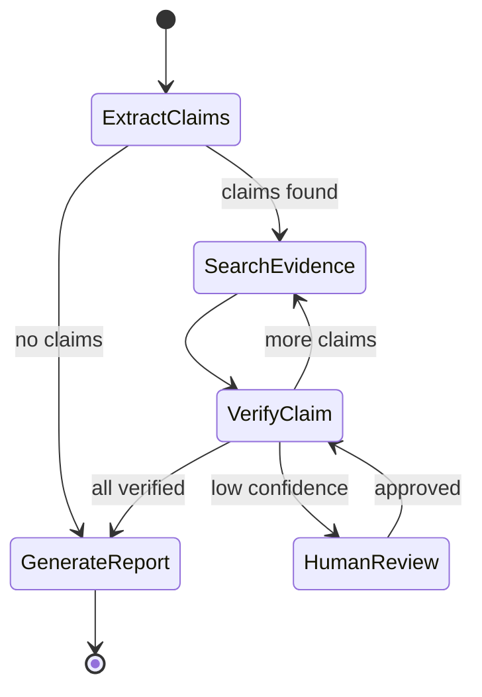

# Workflows

## Standard Workflow



## Claim Extraction

Extracts factual claims as structured data:

```python
# Output: ClaimExtractionOutput
claims: List[{
    "text": "Python was created in 1991",
    "claim_type": "explicit"  # or "implicit", "inferred"
}]
```

Skips:
- Opinions ("This is the best framework")
- Predictions ("Will be released next year")
- Subjective statements ("Easy to use")

!!! note "Claim Types"
    **Explicit** claims are directly stated in the text. **Implicit** claims are reasonably inferred from context (e.g., "Install with pip" implies Python package). **Inferred** claims require domain knowledge to extract. The extractor is conservative, preferring to skip ambiguous statements rather than create false claims.

## Evidence Search

Parallel search across sources:

| Source | When Used | Tools |
|--------|-----------|-------|
| Web | `enable_web_search=True` | DuckDuckGo search, URL fetch |
| Filesystem | `root_path` provided | list_files, read_file, grep_files |

Evidence scored by:
- **Relevance** (0-1): How related to claim
- **Credibility** (0-1): Source trustworthiness
- **Supports**: True/False/None

### Evidence Gathering Flow

The evidence gathering process intelligently selects sources based on claim type and available configuration:



Web search retrieves top results and extracts text content from URLs. The filesystem agent uses ReAct reasoning to intelligently navigate the codebase, choosing which files to read based on the claim being verified. All evidence is scored and ranked, with the most relevant sources surfaced first.

## Verification

Each claim verified by N models:

```python
# Output: VerificationOutput
{
    "verdict": "SUPPORTS",  # or "REFUTES", "NOT_ENOUGH_INFO"
    "confidence": 0.9,
    "reasoning": "Detailed explanation...",
    "key_evidence": "Most important source"
}
```

## Consensus

### Weighted Voting (Default)

```python
votes = {
    "gpt-4o": "SUPPORTS",
    "gpt-4o-mini": "SUPPORTS"
}
# → SUPPORTS (unanimous)

votes = {
    "gpt-4o": "SUPPORTS",
    "gpt-4o-mini": "REFUTES"
}
# → NOT_ENOUGH_INFO (disagreement)
```

### Consensus Decision Flow

The consensus mechanism aggregates model votes with weighted voting and confidence thresholds:



When models unanimously agree, confidence scores are averaged with weights applied. Disagreements trigger conservative fallbacks, typically resulting in NOT_ENOUGH_INFO verdicts. This prevents the system from confidently reporting incorrect information when models can't reach consensus.

### ICE (Iterative Consensus Ensemble)

Models critique each other:

1. Round 1: Initial votes
2. Round 2: Review others' reasoning
3. Round 3: Revise if persuaded

Higher accuracy, 3x slower.

## Human-in-the-Loop

Interrupts for low-confidence claims:

```
Confidence < threshold
        ↓
[INTERRUPT] Human review
        ↓
Approve → Continue
Correct → Update verdict
Skip → Keep original
```

## State Machine Architecture

The evaluation pipeline is implemented as a LangGraph state machine with explicit node transitions:



Each node represents a distinct step in the pipeline. The state machine tracks progress, allowing for interruption, human-in-the-loop review, and resumption from checkpoints. Low-confidence claims can trigger human review nodes before proceeding to final report generation.

## Checkpointing

State persisted after each node:

```python
# Can resume from any point
state = graph.get_state(config)
graph.invoke(None, config)  # Resume
```

Useful for:
- Long-running evaluations
- Human review workflows
- Error recovery

## Streaming Modes

| Mode | Use For |
|------|---------|
| `messages` | Chat-like UI |
| `updates` | Progress bars |
| `values` | Full state snapshots |
| `custom` | Debug/traces |

```python
async for event in graph.astream(input, config, stream_mode="updates"):
    print(event)
```

!!! tip "Choosing Stream Mode"
    Use `updates` mode for CLI progress indicators - it emits events after each node completes. Use `values` mode for debugging - it provides full state snapshots. Use `messages` mode when building chat interfaces that need to display intermediate reasoning.

## Error Handling and Retries

The pipeline implements automatic retry logic for transient failures:

```python
# LLM API failures → Exponential backoff retry (max 3 attempts)
# Network timeouts → Retry with increased timeout
# Rate limits → Automatic backoff and retry
# Parse failures → Structured output regeneration
```

Permanent failures (invalid API keys, malformed inputs) fail immediately without retry. The state machine preserves progress, so partial results are never lost even if the pipeline errors mid-execution.

!!! example "Resuming After Errors"
    If verification fails partway through processing 10 claims, the checkpoint preserves the 6 completed verdicts. Resume with the same `thread_id` to continue from claim 7 rather than starting over.

## Performance Optimization

For large documents with many claims:

- **Batch evidence gathering**: Parallel web search and filesystem exploration
- **Cache LLM calls**: Identical claims reuse previous verdicts
- **Lazy loading**: Only load evidence when confidence is uncertain
- **Early termination**: Skip remaining models if first N agree unanimously

Typical processing times:

| Document Size | Claims | Evidence Sources | Processing Time |
|---------------|--------|------------------|-----------------|
| Small (1-2 pages) | 5-10 | Web only | 30-60 seconds |
| Medium (5-10 pages) | 20-40 | Web + filesystem | 2-5 minutes |
| Large (20+ pages) | 100+ | Web + filesystem | 10-20 minutes |

!!! tip "Speed vs Accuracy Tradeoffs"
    Use `gpt-4o-mini` for extraction and `gpt-4o` for verification to balance speed and accuracy. For maximum speed, use single-model verification with `gpt-4o-mini` only. For maximum accuracy, use ICE consensus with 3+ models including Claude and GPT-4o.
