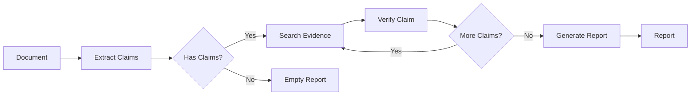
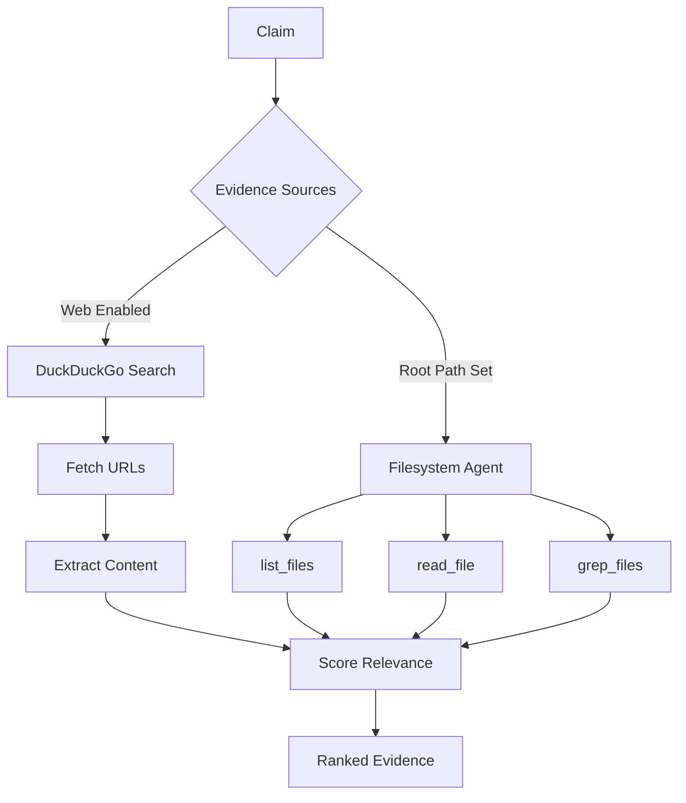
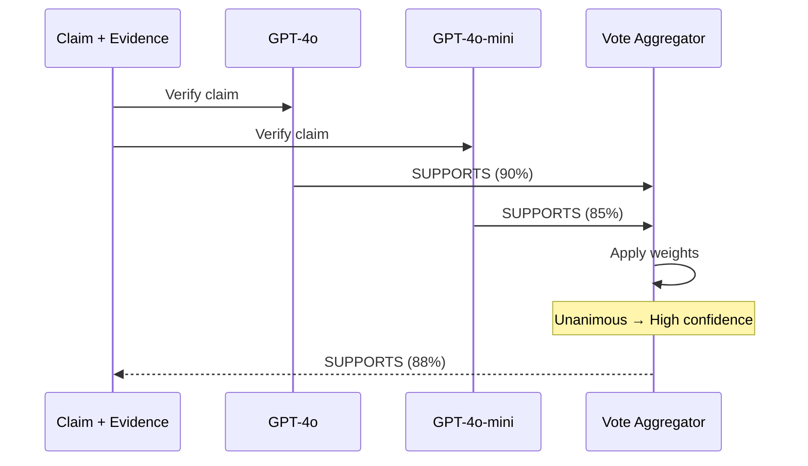
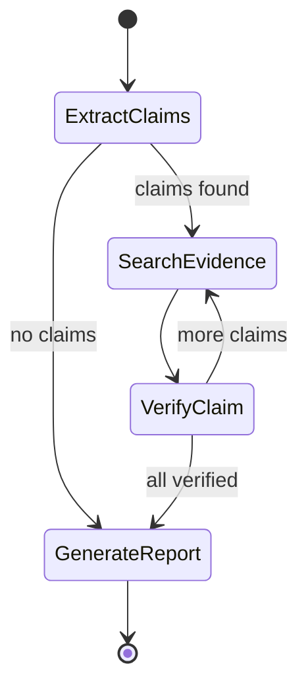

# Workflows

## Pluggable Workflows (New)

The Truthfulness Evaluator now supports a pluggable workflow architecture that allows you to compose custom verification pipelines from interchangeable strategies.

### Using Built-In Presets

Five preset workflows are available out of the box:

```python
from truthfulness_evaluator.llm.workflows.presets import register_builtin_presets
from truthfulness_evaluator.llm.workflows.registry import WorkflowRegistry

# Register built-in workflows
register_builtin_presets()

# Use external verification (web search + multi-model consensus)
config = WorkflowRegistry.get("external")

# Use quick verification (single model + limited web search)
quick_config = WorkflowRegistry.get("quick")

# Use full verification (web + filesystem + consensus)
full_config = WorkflowRegistry.get("full")

# Use precise verification (span-grounded extraction that quotes the
# source verbatim, with web + filesystem evidence and consensus)
precise_config = WorkflowRegistry.get("precise")

# Use internal verification (codebase alignment)
from truthfulness_evaluator.llm.workflows.presets import create_internal_config
internal_config = create_internal_config(root_path="/path/to/project")
```

!!! tip "Avoiding misquotes"
    The `precise` preset uses `SentenceSelectionExtractor`, which has the model
    select claim-bearing sentences *by index* rather than rewriting them. Claim
    text is sliced verbatim from the source, so the evaluator never verifies a
    paraphrased or fabricated version of a claim. See the
    [architecture guide](../architecture/workflows.md#span-grounded-extraction-sentenceselectionextractor).

### Creating Custom Workflows

Compose your own workflows from adapter strategies:

```python
from truthfulness_evaluator.llm.workflows.config import WorkflowConfig
from truthfulness_evaluator import SentenceSelectionExtractor
from truthfulness_evaluator import WebSearchGatherer, FilesystemGatherer, CompositeGatherer
from truthfulness_evaluator import ConsensusVerifier
from truthfulness_evaluator import JsonFormatter, MarkdownFormatter

config = WorkflowConfig(
    name="custom",
    description="Custom verification pipeline.",
    # Span-grounded extraction keeps claim text verbatim from the source.
    extractor=SentenceSelectionExtractor(model="gpt-4o"),
    gatherers=[CompositeGatherer([
        WebSearchGatherer(max_results=5),
        FilesystemGatherer()
    ])],
    verifier=ConsensusVerifier(models=["gpt-4o", "claude-sonnet-4-5"]),
    formatters=[JsonFormatter(), MarkdownFormatter()],
)
```

See the [Pluggable Workflow Architecture](../architecture/workflows.md) documentation for complete details on protocols, adapters, and workflow composition.

!!! info "Legacy Workflow"
    The monolithic graph API described below (`create_truthfulness_graph`) still works and is fully supported. However, the pluggable workflow system is the recommended approach going forward for new integrations and custom pipelines.

## Standard Workflow


```mermaid
graph LR
    A[Document] --> B[Extract Claims]
    B --> C{Has Claims?}
    C -->|Yes| D[Search Evidence]
    C -->|No| E[Empty Report]
    D --> F[Verify Claim]
    F --> G{More Claims?}
    G -->|Yes| D
    G -->|No| H[Generate Report]
    H --> I[Report]
```

## Claim Extraction

Extracts factual claims as structured data:

```python
# Output: ClaimExtractionOutput
claims: List[{
    "text": "Python was created in 1991",
    "claim_type": "explicit"  # or "implicit", "inferred"
}]
```

Skips:
- Opinions ("This is the best framework")
- Predictions ("Will be released next year")
- Subjective statements ("Easy to use")

!!! note "Claim Types"
    **Explicit** claims are directly stated in the text. **Implicit** claims are reasonably inferred from context (e.g., "Install with pip" implies Python package). **Inferred** claims require domain knowledge to extract. The extractor is conservative, preferring to skip ambiguous statements rather than create false claims.

## Evidence Search

Parallel search across sources:

| Source | When Used | Tools |
|--------|-----------|-------|
| Web | `enable_web_search=True` | DuckDuckGo search, URL fetch |
| Filesystem | `root_path` provided | list_files, read_file, grep_files |

Evidence scored by:
- **Relevance** (0-1): How related to claim
- **Credibility** (0-1): Source trustworthiness
- **Supports**: True/False/None

### Evidence Gathering Flow

The evidence gathering process intelligently selects sources based on claim type and available configuration:


```mermaid
graph TD
    A[Claim] --> B{Evidence Sources}
    B -->|Web Enabled| C[DuckDuckGo Search]
    B -->|Root Path Set| D[Filesystem Agent]
    C --> E[Fetch URLs]
    E --> F[Extract Content]
    D --> G[list_files]
    D --> H[read_file]
    D --> I[grep_files]
    F --> J[Score Relevance]
    G --> J
    H --> J
    I --> J
    J --> K[Ranked Evidence]
```

Web search retrieves top results and extracts text content from URLs. The filesystem agent uses ReAct reasoning to intelligently navigate the codebase, choosing which files to read based on the claim being verified. All evidence is scored and ranked, with the most relevant sources surfaced first.

## Verification

Each claim verified by N models:

```python
# Output: VerificationOutput
{
    "verdict": "SUPPORTS",  # or "REFUTES", "NOT_ENOUGH_INFO"
    "confidence": 0.9,
    "reasoning": "Detailed explanation...",
    "key_evidence": "Most important source"
}
```

## Consensus

### Weighted Voting (Default)

```python
votes = {
    "gpt-4o": "SUPPORTS",
    "gpt-4o-mini": "SUPPORTS"
}
# → SUPPORTS (unanimous)

votes = {
    "gpt-4o": "SUPPORTS",
    "gpt-4o-mini": "REFUTES"
}
# → NOT_ENOUGH_INFO (disagreement)
```

### Consensus Decision Flow

The consensus mechanism aggregates model votes with weighted voting and confidence thresholds:


```mermaid
sequenceDiagram
    participant C as Claim + Evidence
    participant M1 as GPT-4o
    participant M2 as GPT-4o-mini
    participant V as Vote Aggregator

    C->>M1: Verify claim
    C->>M2: Verify claim
    M1->>V: SUPPORTS (90%)
    M2->>V: SUPPORTS (85%)
    V->>V: Apply weights
    Note over V: Unanimous → High confidence
    V-->>C: SUPPORTS (88%)
```

The reported confidence is the weighted **agreement** fraction for the leading verdict,
not an average of the models' self-reported confidence scores — self-reported confidence
is known to be poorly calibrated, so it's recorded per-model but not used to decide the
outcome. When models unanimously agree, agreement is 1.0 and confidence is high.
Disagreement (or a tie for the lead) drops the weighted agreement below the threshold and
the ensemble abstains to `NOT_ENOUGH_INFO`, rather than confidently reporting a verdict the
panel didn't actually agree on.

## Human-in-the-Loop

There is no separate human-review node. `enable_human_review` makes the `verify_claim`
node call LangGraph's `interrupt()` in place for low-confidence claims, pausing execution
mid-node rather than routing to another node:

```
Confidence < threshold
        ↓
[INTERRUPT] inside verify_claim
        ↓
Approve → Continue
Correct → Update verdict
Skip → Keep original
```

## State Machine Architecture

The evaluation pipeline is implemented as a LangGraph state machine with explicit node transitions:


```mermaid
stateDiagram-v2
    [*] --> ExtractClaims
    ExtractClaims --> SearchEvidence : claims found
    ExtractClaims --> GenerateReport : no claims
    SearchEvidence --> VerifyClaim
    VerifyClaim --> SearchEvidence : more claims
    VerifyClaim --> GenerateReport : all verified
    GenerateReport --> [*]
```

Each node represents a distinct step in the pipeline. The state machine tracks progress,
allowing for interruption and resumption from checkpoints. Human-in-the-loop review is not
a node in this diagram — it is an `interrupt()` call inside `VerifyClaim` (see
[Human-in-the-Loop](#human-in-the-loop) above), so the graph structure is unchanged whether
or not review is enabled. For the literal compiled-graph structure, see
[Graph Reference](../api/graph.md#authoritative-graph-structure).

## Checkpointing

State persisted after each node:

```python
# Can resume from any point
state = graph.get_state(config)
graph.invoke(None, config)  # Resume
```

Useful for:
- Long-running evaluations
- Human review workflows
- Error recovery

## Streaming Modes

| Mode | Use For |
|------|---------|
| `messages` | Chat-like UI |
| `updates` | Progress bars |
| `values` | Full state snapshots |
| `custom` | Debug/traces |

```python
async for event in graph.astream(input, config, stream_mode="updates"):
    print(event)
```

!!! tip "Choosing Stream Mode"
    Use `updates` mode for CLI progress indicators - it emits events after each node completes. Use `values` mode for debugging - it provides full state snapshots. Use `messages` mode when building chat interfaces that need to display intermediate reasoning.

## Error Handling and Retries

The pipeline implements automatic retry logic for transient failures:

```python
# LLM API failures → Exponential backoff retry (max 3 attempts)
# Network timeouts → Retry with increased timeout
# Rate limits → Automatic backoff and retry
# Parse failures → Structured output regeneration
```

Permanent failures (invalid API keys, malformed inputs) fail immediately without retry. The state machine preserves progress, so partial results are never lost even if the pipeline errors mid-execution.

!!! example "Resuming After Errors"
    If verification fails partway through processing 10 claims, the checkpoint preserves the 6 completed verdicts. Resume with the same `thread_id` to continue from claim 7 rather than starting over.

## Performance Optimization

For large documents with many claims:

- **Batch evidence gathering**: Parallel web search and filesystem exploration
- **Cache LLM calls**: Identical claims reuse previous verdicts
- **Lazy loading**: Only load evidence when confidence is uncertain
- **Early termination**: Skip remaining models if first N agree unanimously

Typical processing times:

| Document Size | Claims | Evidence Sources | Processing Time |
|---------------|--------|------------------|-----------------|
| Small (1-2 pages) | 5-10 | Web only | 30-60 seconds |
| Medium (5-10 pages) | 20-40 | Web + filesystem | 2-5 minutes |
| Large (20+ pages) | 100+ | Web + filesystem | 10-20 minutes |

!!! tip "Speed vs Accuracy Tradeoffs"
    Use `gpt-4o-mini` for extraction and `gpt-4o` for verification to balance speed and accuracy. For maximum speed, use single-model verification with `gpt-4o-mini` only. For maximum accuracy, use a few genuinely diverse strong models (e.g. Claude and GPT-4o rather than two same-family models) and tune the agreement threshold to the precision you need.
